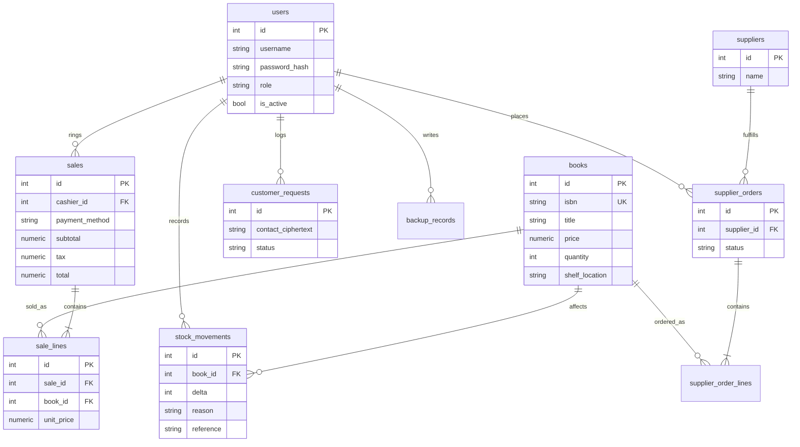

# Entity relationship — Ledger & Spine

```mermaid
erDiagram
    users ||--o{ sales : rings
    users ||--o{ stock_movements : records
    users ||--o{ supplier_orders : places
    users ||--o{ customer_requests : logs
    users ||--o{ backup_records : writes
    books ||--o{ stock_movements : affects
    books ||--o{ sale_lines : sold_as
    books ||--o{ supplier_order_lines : ordered_as
    sales ||--|{ sale_lines : contains
    suppliers ||--o{ supplier_orders : fulfills
    supplier_orders ||--|{ supplier_order_lines : contains

    users {
        int id PK
        string username
        string password_hash
        string role
        bool is_active
    }
    books {
        int id PK
        string isbn UK
        string title
        numeric price
        int quantity
        string shelf_location
    }
    stock_movements {
        int id PK
        int book_id FK
        int delta
        string reason
        string reference
    }
    sales {
        int id PK
        int cashier_id FK
        string payment_method
        numeric subtotal
        numeric tax
        numeric total
    }
    sale_lines {
        int id PK
        int sale_id FK
        int book_id FK
        numeric unit_price
    }
    suppliers {
        int id PK
        string name
    }
    supplier_orders {
        int id PK
        int supplier_id FK
        string status
    }
    customer_requests {
        int id PK
        string contact_ciphertext
        string status
    }
```

Staging and production: PostgreSQL 16. Automated tests: SQLite. Same SQLAlchemy models; dialect differences are limited to the connection URL.
